# Sklep z elektroniką (01.2022)
Aplikacja została zrealizowana w ramach zajęć projektowych Bazy danych 2 na Politechnice Wrocławskiej. Stworzono desktopowy i bazodanowy sklep sieciowy z drobną elektroniką np. myszki, czy laptopy. Głównym powodem stworzenia systemu jest usprawnienie pracy firmy oraz zapewnienie wygodnej i szybkiej obsługi klienta. Wstępnie zakładano, że dla klienta będzie zrealizowana aplikacja webowa, a dla pracownika desktopowa, ale niestety z powodu braku wystarczającego czasu udało się jedynie zrealizować w dużej części aplikację dla pracownika.

Do uruchomienia aplikacji będą potrzebne:
* Zainstalowanie DBMS Oracle Database,
* Odpalenie skryptu ```sql_code/add_all.sql```,
* Uruchomienie aplikacji poprzez plik jar ```app.jar```.

## Zakres projektu:
* Analiza wymagań,
* Projekt bazy danych,
* Modelowanie aplikacji,
* Implementacja i testowanie bazy danych,
* Implementacja i testy aplikacji,
* Opracowanie końcowej dokumentacji.

## Wymagania funckjonalne:
* Pracownik może zarządzać produktami,
* Koszyk (nie zrealizowano),
* Składanie zamówień (nie zrealizowano),
* Historia zamówień (nie zrealizowano),
* Płatność za zamówienie (nie zrealizowano),
* Rozbudowana przeglądarka produktów,
* Pracownik może zarządzać zamówieniami np. zatwierdzić, czy usunąć,
* Logowanie,
* Rejestracja,
* Wylogowanie,
* Edycja własnych danych osobowych.

## Wymagania niefunkcjonalne:
### Bezpieczeństwo:
* Jedynie zalogowany klient może złożyć zamówienie,
* Każdy pracownik ma swoje konto.
### Technologie i narzędzia:
* DMBS - Oracle Database,
* Język programowania - Java,
* Połączenie z bazą danych z poziomu Javy - JDBC,
* GUI - Swing,
* Środowisko programistyczne - Eclipse,
* Diagramy - Visual Paradigm,
* Dokumentacja - Microsoft Word,
* Windows.

## Projekt bazy danych:

Uproszczony model konceptualny:
<p align="center">
    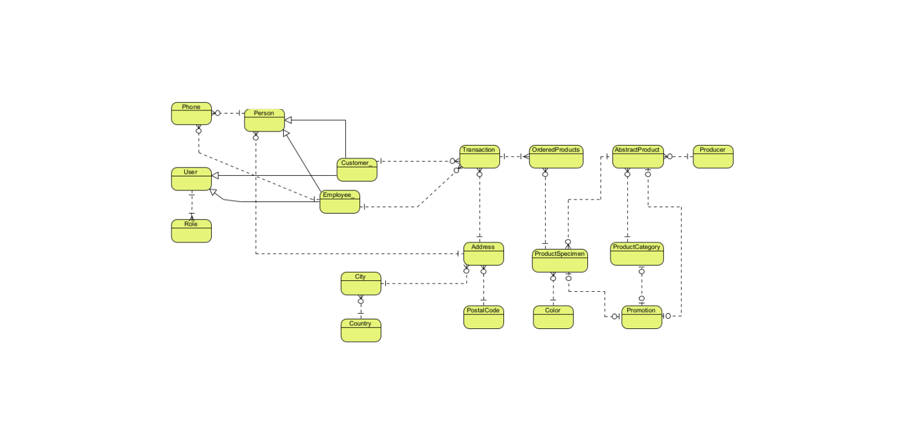
</p>

Model logiczny:
<p align="center">
    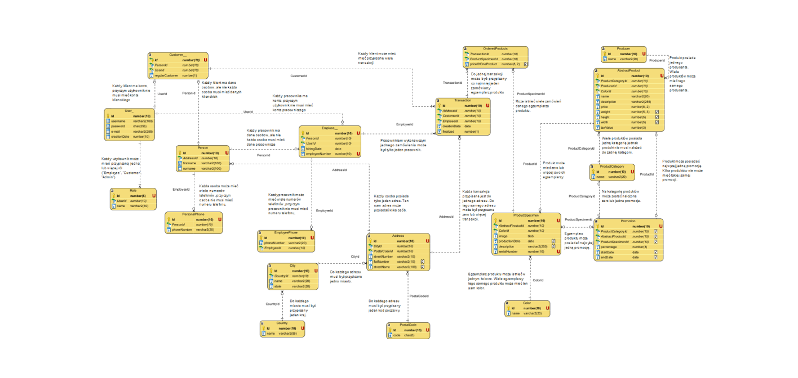
</p>

Model fizyczny:
<p align="center">
    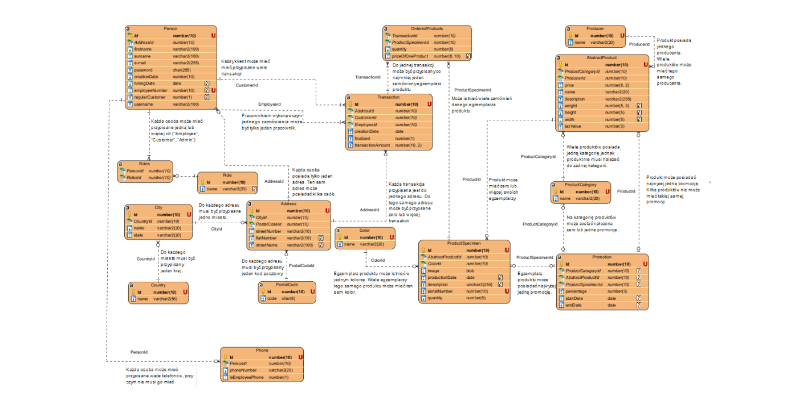
</p>

### Sekwencje:
np. sekwencja dla klucza głównego:
```
CREATE SEQUENCE BD_2.COUNTRY_ID_SEQ
MINVALUE 1
INCREMENT BY 1;
```

### Triggery:
np. trigger generujący następną wartość klucza głównego:
```
CREATE OR REPLACE TRIGGER BD_2.COUNTRY_ID_T
BEFORE INSERT ON BD_2.COUNTRY
FOR EACH ROW
 WHEN (NEW.Id is NULL)
BEGIN
 :NEW.Id := COUNTRY_ID_SEQ.NEXTVAL;
END;
```

### Widoki:
np. widok sfinalizowanych zamówień i przypisanych do nich klientów:
```
CREATE VIEW BD_2.finalized_Orders AS
SELECT t.transaction_Amount, t.creation_Date, p.firstname, p.surname, p.Id, p.regular_Customer, p.e_mail
FROM BD_2.Transaction_t t
INNER JOIN BD_2.Person p ON t.Customer_Id = p.Id AND t.Employee_Id = p.Id
WHERE p.employee_Number IS NULL;
```

### Indeksy:
np. indeks na nazwy produktów:
```
CREATE INDEX BD_2.product_name
ON BD_2.Abstract_Product (name);
```

### Procedury składowane:
np. utworzenie transakcji:
```
CREATE OR REPLACE PROCEDURE BD_2.INSERT_TRANSACTION (
    creation_Date DATE, Customer_Id NUMBER, Employee_Id NUMBER, Address_Id NUMBER, transaction_Amount NUMBER
) AS
BEGIN
    INSERT INTO BD_2.TRANSACTION_t (Address_Id, Customer_Id, Employee_Id, creation_Date, finalized, transaction_Amount)
    VALUES(Address_Id, Customer_Id, Employee_Id, creation_Date, 0, transaction_Amount);
END;
```

### Uprawnienia:
<p align="center">
    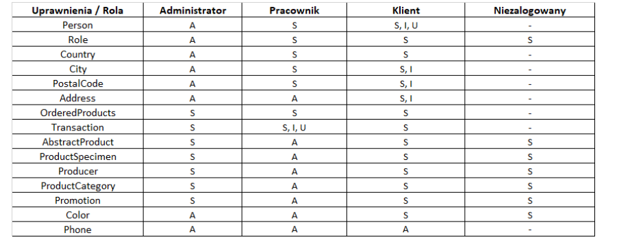
</p>

np. umożliwienie klientowi i pracownikowi pobierania, dodawania i edytowania wierszy w tabeli z danymi użytkowników:
```
GRANT SELECT, INSERT, UPDATE ON BD_2.PERSON
TO EMPLOYEE, CUSTOMER;
```

## Diagram przypadków użycia dla aplikacji:
<p align="center" width="100%">
    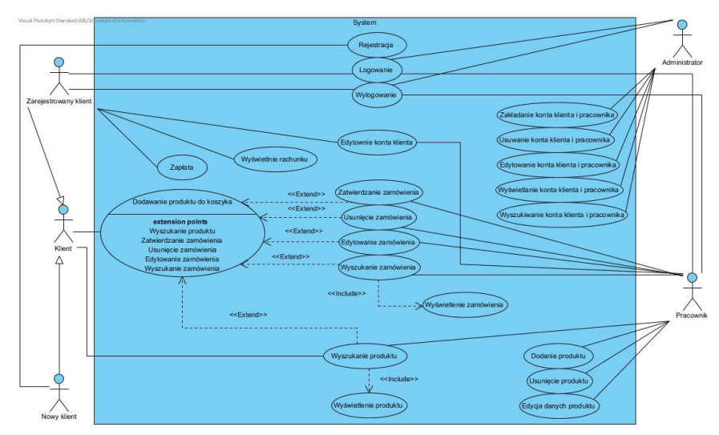
</p>

## Testy bazy danych
Przeprowadzono testy wydajnościowe w ramach których m.in. porównano czasy wykonania danej liczby zapytań z wykorzystaniem indeksów oraz bez ich wykorzystania.

np. dla 200000-krotnego wykonania zapytania:
```
SELECT *
FROM BD_2.ABSTRACT_PRODUCT
WHERE PRICE > 2
ORDER BY PRICE DESC;
```

z indeksami uzyskano czas 5 sekund, a bez indeksów aż 7 minut i 4 sekundy.

Oprócz testów wydajnościowych przeprowadzono jeszcze testy akceptacyjne oraz testy uprawnień.

## Technologie:
* DBMS - Oracle Database,
* Język programowania dla aplikacji - Java,
* Połączenie z DBMS od strony Javy - JDBC,
* Automatyzacja budowy aplikacji - Maven,
* GUI - Swing,
* Diagramy - Visual Paradigm,
* Dokumentacja - Microsoft Word.

## Zrzuty ekranu:

Menu:
<p align="center">
    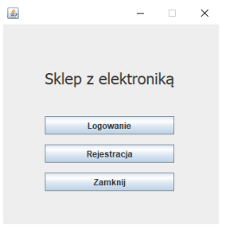
</p>

Logowanie:
<p align="center">
    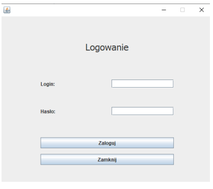
</p>

Dla najważniejszych pól wejściowych wprowadzono walidację np. dla logowania:
<p align="center">
    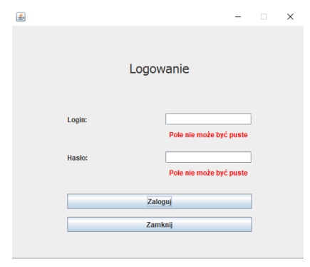
</p>

Po wykonaniu ważnych działań np. logowania, wyświetlany jest odpowiedni komunikat o sukcesie albo wystąpieniu błędu:
<p align="center">
    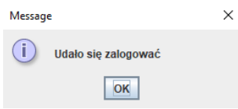
</p>

Rejestracja:
<p align="center">
    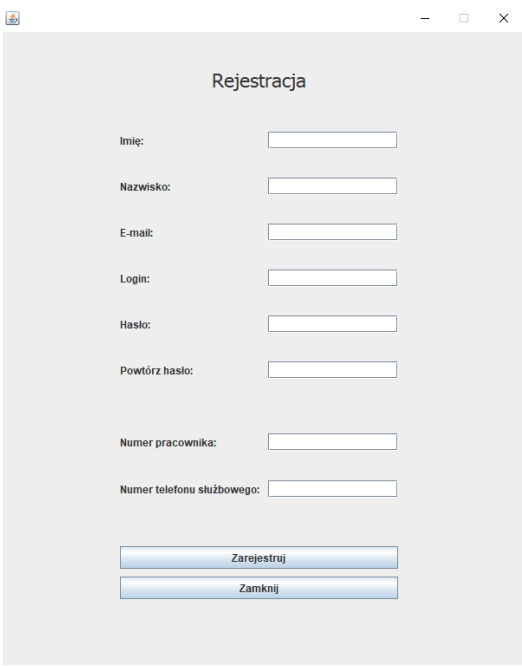
</p>

Menu pracownika po zalogowaniu:
<p align="center">
    
</p>

Pracownik aktualizuje swoje dane:
<p align="center">
    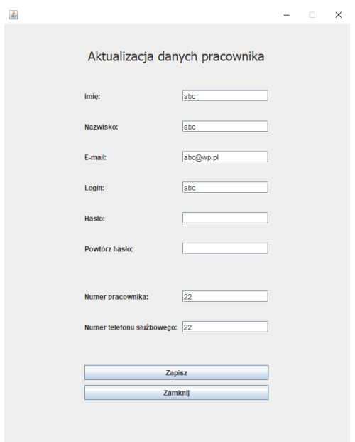
</p>

Zasoby sklepu widziane przez pracownika:
<p align="center">
    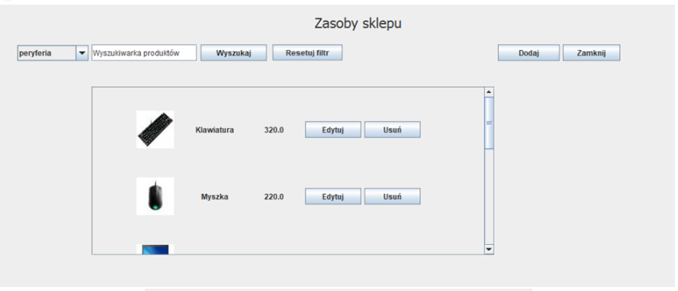
</p>

Detale produktu:
<p align="center">
    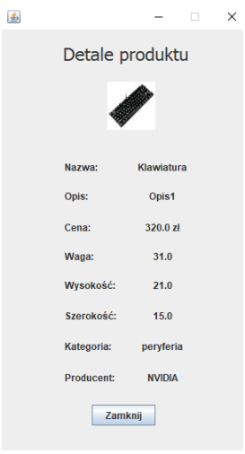
</p>

Utworzenie/Edycja produktu:
<p align="center">
    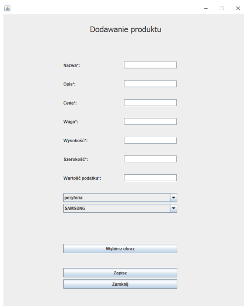
</p>
